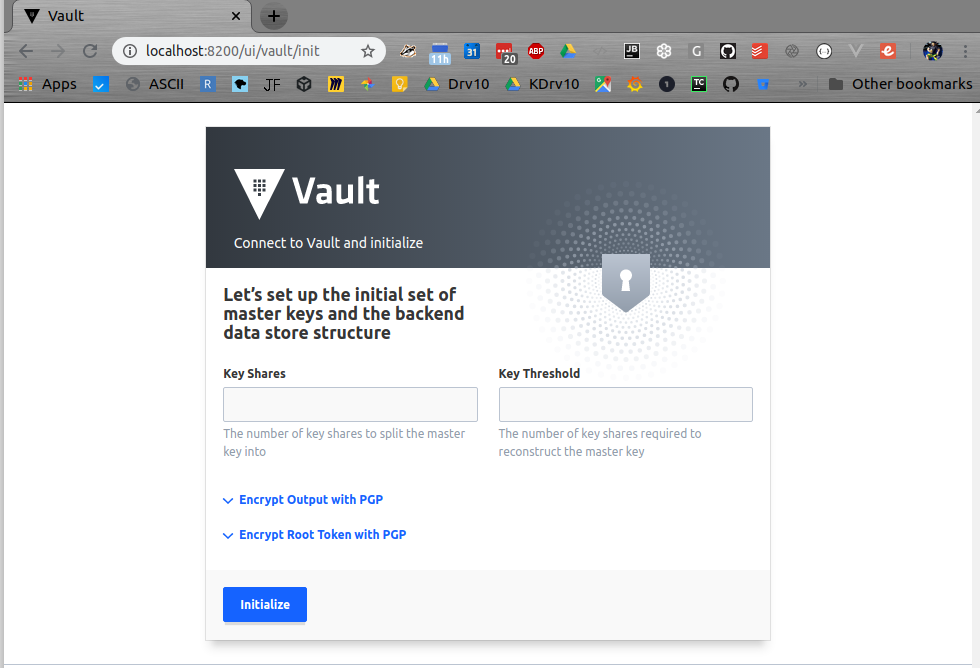

# react-spring-docker-framework

# Summary

Prototype implementation of a completed development framework

# Key Goals

* Security

* Repeatability

* Constant Patching 

* Automated Testing

* Partitioning

* Accessible

* Maintained Open Source  

## Security

All communications between nodes will be encrypted using rotating two=factor authorization and authentication.


using reactui, 
java springboot back end
docker-compose local development
mongo (app data)
vault (security)

## Add lINK TO DOCKER-COMPOSE README

## Setup Development Infrastructure


###  Step #1, Setup Security platform

#### Vault

Vault security encrypts all data in the system to we can story "Secrets". 
Secrets such as username and passwords to databases, 
which you want to be able to change on a regular bases automatically.
Addtionally, you don't what the encryption key be known by only one person.
Vault provides a way to split the key so you might have 10 key but require 3,5,9 or 10 to unlock. 
  

##### Setting up Vault Security First Time 

Vault requires a split key for auth  // TODO: figure out a production implementation automation
 
 
 
 #### Setup mongo databases
  
 access mongo console
 
 ```bash
 mongo
 ```
 
 
 #### Configure replica
 Run in mongo Console
 ```mongo command        
 rs.initiate(
   {
     _id : 'rs0',
     members: [
       { _id : 0, host : "mongo1:27017" },
       { _id : 1, host : "mongo2:27017" },
       { _id : 2, host : "mongo3:27017" }
     ]
   }
 )
 ```

 